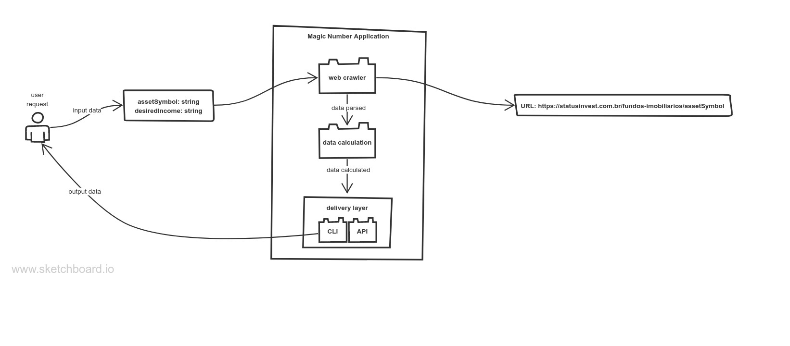

# Magic-number
<!-- 
List of TODOs:
	TODO: Tests
	TODO: Logs
	TODO: Docker
	TODO: start the Flutter app and consume the api
 -->

## Architecture




## Calculate passive income

<br>
- With Go installed on your machine, run `go run main.go`

- Type in your [FII](https://fiis.com.br/artigos/o-que-e-fii/) _(ex: HGLG11)_

- Type in your desired monthly passive income. _(ex: 1000)_

- Get the results

<br>

### Console output example:


### JSON output example:

```
{
    "asset": {
        "symbol": "HGLG11",
        "name": "CGHG Logística",
        "price": "176.87",
        "yieldAverage24m": "0.77100000",
        "dividendYield": "6.20%",
        "minPrice52wk": "117.05",
        "maxPrice52wk": "196.50",
        "performanceLast12m": "-0,56%",
        "performanceThisMonth": "-0,18%",
        "goals": {
            "magicNumber": "229",
            "capitalSnowBallEffect": "40503.23",
            "desiredMonthlyIncome": "1000",
            "assetQuantityDesiredIncome": "1297.02",
            "capitalDesiredMonthlyIncome": "229403.37"
        }
    }
}
```

<br>

## Happy Investing!
